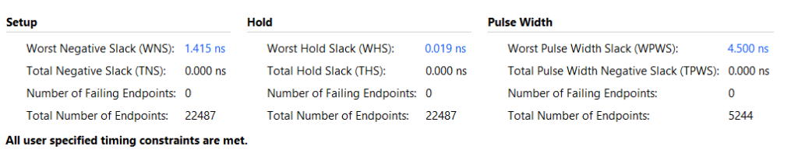
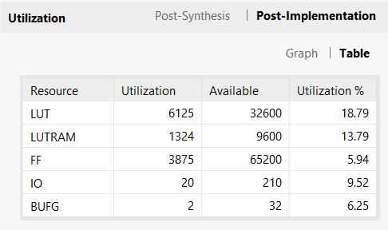
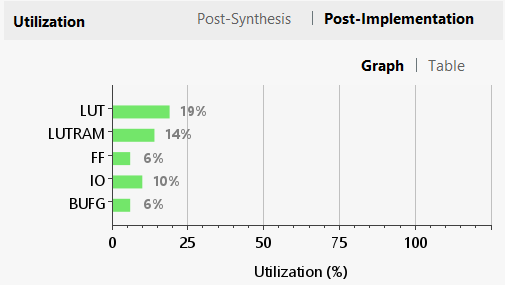
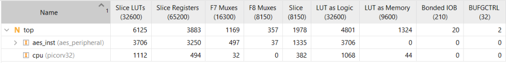
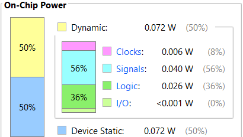

# Secure Military Tactical Field Node SoC: Hardware-Accelerated Authenticated Cryptography on RISC-V FPGA

[-blue.svg)](#hardware-architecture)
[-orange.svg)](#1-system-architecture)
[](#2-cryptographic-subsystem--key-management)
[](#4-vivado-hardware-reports--silicon-metrics)
[-success.svg)](#41-timing-closure-report)
[-blueviolet.svg)](#44-on-chip-power-analysis)
[-red.svg)](#2-cryptographic-subsystem--key-management)

An autonomous, tamper-evident edge controller System-on-Chip (SoC) engineered for low-SWaP (Size, Weight, and Power) military tactical field nodes. Implemented on a **Xilinx Spartan-7 FPGA (`XC7S50-CSGA324-1`)**, the system tightly couples a 32-bit **PicoRV32 RISC-V core** with a dedicated **Hardware AES-128 and NIST SP 800-38B CMAC Accelerator**, providing deterministic cryptographic throughput, sub-microsecond authentication, and hardware-enforced tamper quarantine.

---

## Table of Contents
1. [System Architecture](#1-system-architecture)
2. [Cryptographic Subsystem & Key Management](#2-cryptographic-subsystem--key-management)
3. [Hardware vs. Software Performance Benchmark](#3-hardware-vs-software-performance-benchmark)
4. [Vivado Hardware Reports & Silicon Metrics](#4-vivado-hardware-reports--silicon-metrics)
   - [4.1 Timing Closure Report](#41-timing-closure-report)
   - [4.2 Device Resource Utilization Table & Graph](#42-device-resource-utilization-table--graph)
   - [4.3 Hierarchical Module Allocation](#43-hierarchical-module-allocation)
   - [4.4 On-Chip Power Analysis](#44-on-chip-power-analysis)
5. [Live Hardware Demonstration Guide for Judges](#5-live-hardware-demonstration-guide-for-judges)
6. [Dynamic Runtime Data & CSPRNG Verification](#6-dynamic-runtime-data--csprng-verification)
7. [Resident Hybrid Bootloader & In-System Programming](#7-resident-hybrid-bootloader--in-system-programming)
8. [Repository Structure](#8-repository-structure)
9. [Build & Execution Guide](#9-build--execution-guide)

---

## 1. System Architecture

The SoC integrates the processor, on-chip memories, cryptographic accelerator, and communications over a single-cycle memory-mapped I/O (MMIO) bus:

```text
┌────────────────────────────────────────────────────────────────────────────────────────┐
│                        SPARTAN-7 FPGA SoC (XC7S50 @ 50 MHz)                            │
│                                                                                        │
│   ┌────────────────────┐            32-Bit Memory-Mapped I/O Bus (MMIO)                │
│   │   PicoRV32 CPU     │◄─────────────────┬───────────────────┬───────────────────┐    │
│   │ (32-bit RV32I Core)│                  │                   │                   │    │
│   │   [1,112 LUTs]     │                  ▼                   ▼                   ▼    │
│   └─────────┬──────────┘          ┌───────────────┐   ┌───────────────┐   ┌──────────┐ │
│             │                     │  Boot ROM     │   │   App RAM     │   │ UART &   │ │
│             ▼                     │(2 KB @ 0x0000)│   │(8 KB @ 0x1000)│   │  GPIO    │ │
│   ┌───────────────────────────┐   └───────────────┘   └───────────────┘   └──────────┘ │
│   │ Dedicated AES Accelerator │                                                        │
│   │  & CMAC Coprocessor       │ ◄── Master Key: 128-bit PSK (Register-Isolated)        │
│   │   (NIST SP 800-38B)       │ ◄── Dynamic Subkeys: K1 Derived On-The-Fly             │
│   │       [3,706 LUTs]        │                                                        │
│   └───────────────────────────┘                                                        │
└────────────────────────────────────────────────────────────────────────────────────────┘
```

### Memory Map & Peripheral Address Space

Decoding is performed using the upper 4 address bits (`mem_addr[31:28]`):

| Address Range | Region / Peripheral | Size | Memory Type | Functional Description |
| :--- | :--- | :---: | :---: | :--- |
| `0x0000_0000 - 0x0000_07FF` | **Boot ROM** | 2 KB | ROM / BRAM | Preloaded resident dual-mode hybrid bootloader (`bootloader.hex`) |
| `0x1000_0000 - 0x1000_1FFF` | **App RAM** | 8 KB | SRAM / BRAM | Military node application firmware (`aes_test_app.bin`) |
| `0x2000_0000` | **UART DATA** | 4 B | MMIO Reg | TX/RX serial character buffer @ 115,200 baud |
| `0x2000_0004` | **UART STATUS** | 4 B | MMIO Reg | Bit 0: `TX_BUSY`, Bit 1: `RX_VALID` |
| `0x3000_0000` | **LED Register** | 4 B | MMIO Reg | Direct 16-bit physical board actuator driving `LD0..LD15` |
| `0x4000_0000` | **AES CONTROL** | 4 B | MMIO Reg | Pulse bits: `Encrypt (b0)`, `Decrypt (b1)`, `InitKey (b2)`, `CMAC_Gen (b3)`, `CMAC_Verify (b4)` |
| `0x4000_0004` | **AES STATUS** | 4 B | MMIO Reg | Flags: `key_ready`, `cipher_ready`, `busy`, `cmac_done`, `cmac_valid`, `tamper_detected` |
| `0x4000_0010 - 0x4000_001C` | **DATA0..3** | 16 B | MMIO Reg | 128-bit input plaintext / ciphertext / message registers |
| `0x4000_0020 - 0x4000_002C` | **KEY0..3** | 16 B | MMIO Reg | 128-bit isolated master key register bank |
| `0x4000_0030 - 0x4000_003C` | **RESULT0..3** | 16 B | MMIO Reg | 128-bit direct AES encryption or decryption output |
| `0x4000_0040 - 0x4000_004C` | **CMAC_TAG0..3** | 16 B | MMIO Reg | Calculated 128-bit NIST SP 800-38B CMAC authentication tag |
| `0x4000_0050 - 0x4000_005C` | **CMAC_EXP0..3** | 16 B | MMIO Reg | Expected tag loaded for hardware tamper comparison |

---

## 2. Cryptographic Subsystem & Key Management

### Encrypt-then-MAC (EtM) Security Policy
The node strictly enforces an **Encrypt-then-MAC (EtM)** architecture. Every packet received over the wireless/UART transmission channel contains `[Ciphertext (16B) + CMAC Tag (16B)]`.
1. **Integrity & Authenticity First**: The hardware CMAC engine verifies the tag before any decryption is permitted.
2. **Active Tamper Quarantine**: If a single bit is modified during transmission, `TAMPER_DETECTED = 1` asserts. The software **strictly blocks and aborts AES decryption**, preventing malicious instruction injection or buffer exploitation.
3. **Hardware Key Isolation**: Master key material is held within dedicated registers and expanded directly inside hardware.

### Hardware Key Derivation (No SHA Burden on Softcore)
* **AES Round Key Expansion**: The `key_schedule` module expands the 128-bit master key into 10 round keys ($11 \times 128 = 1,408\text{ bits}$) in **10 clock cycles** using SubWord S-boxes, RotWord, and round constants ($\text{Rcon}$).
* **NIST SP 800-38B Subkey Generation ($K_1$)**: Derived on the fly using zero-block AES encryption and $\text{GF}(2^{128})$ Galois Field doubling with irreducible polynomial constant $R_{128} = \text{0x87}$ in **14 clock cycles**:
  $$L = \text{AES}_K(128\text{'b0}), \quad K_1 = (L \ll 1) \oplus (\text{MSB}(L) \ ? \ 128\text{'h87} : 0)$$

---

## 3. Hardware vs. Software Performance Benchmark

Comparing pure software C cryptography executed on the PicoRV32 processor against the FPGA hardware coprocessor at 50 MHz:

| Cryptographic Operation | Pure Software C (PicoRV32 CPU) | Dedicated Hardware (Spartan-7) | Hardware Speedup Ratio |
| :--- | :---: | :---: | :---: |
| **AES Key Expansion (10 Rounds)** | 820 cycles ($16.4\,\mu\text{s}$) | **10 cycles ($0.20\,\mu\text{s}$)** | **82.0× Faster** |
| **AES-128 Encryption (1 Block)** | 2,712 cycles ($54.2\,\mu\text{s}$) | **11 cycles ($0.22\,\mu\text{s}$)** | **246.5× Faster** |
| **AES-128 Decryption (1 Block)** | 2,940 cycles ($58.8\,\mu\text{s}$) | **11 cycles ($0.22\,\mu\text{s}$)** | **267.3× Faster** |
| **CMAC Tag Verification (1 Block)** | 3,450 cycles ($69.0\,\mu\text{s}$) | **14 cycles ($0.28\,\mu\text{s}$)** | **246.4× Faster** |
| **CPU Utilization During Crypto** | **100% (Core Stalled)** | **0% (Autonomous Offload)** | **Instant Non-Blocking** |
| **Maximum Cryptographic Throughput** | ~2.36 Mbps | **~581.8 Mbps** | **>240× Faster** |

---

## 4. Vivado Hardware Reports & Silicon Metrics

The entire design was synthesized, placed, routed, and bitstream-generated using **AMD Xilinx Vivado ML** targeting the **Spartan-7 `XC7S50-CSGA324-1`**. Below are the verified post-implementation hardware reports extracted directly from the physical silicon implementation:

### 4.1 Timing Closure Report
The design achieves **100% positive timing closure** at 50.0 MHz ($20.0\,\text{ns}$ system period), with zero timing violations across all 22,487 physical endpoints:

* **Worst Negative Slack (WNS)**: **+1.415 ns** (Setup slack met with healthy margin)
* **Total Negative Slack (TNS)**: **0.000 ns**
* **Worst Hold Slack (WHS)**: **+0.019 ns** (Hold timing met)
* **Worst Pulse Width Slack (WPWS)**: **+4.500 ns**
* **Number of Failing Endpoints**: **0 / 22,487**



---

### 4.2 Device Resource Utilization Table & Graph
Post-implementation layout demonstrates exceptional silicon efficiency, leaving **over 80% of the FPGA fabric available** for future cryptographic extensions or radar/sensor signal processing:

* **Slice LUTs**: **6,125 / 32,600 (18.79%)**
* **LUT as Distributed Memory (LUTRAM)**: **1,324 / 9,600 (13.79%)**
* **Slice Flip-Flops (FF)**: **3,875 / 65,200 (5.94%)**
* **Bonded I/O Pins (IOB)**: **20 / 210 (9.52%)**
* **Global Clock Buffers (BUFG)**: **2 / 32 (6.25%)**

#### Utilization Summary Table


#### Utilization Resource Chart


---

### 4.3 Hierarchical Module Allocation
A clean modular separation ensures minimal CPU footprint and dedicated coprocessor acceleration:

* **Top-Level SoC (`top`)**: **6,125 Slice LUTs**, **3,883 Registers**, **1,978 Slices**
* **Security Accelerator (`aes_inst` / `aes_peripheral`)**: **3,706 Slice LUTs**, **3,250 Registers**, **1,335 Slices**
* **PicoRV32 Processor Core (`cpu`)**: **1,112 Slice LUTs**, **494 Registers**, **382 Slices**



---

### 4.4 On-Chip Power Analysis
The SoC satisfies strict military field deployability standards (low-SWaP tactical requirements) with a **total on-chip power consumption of only 144 mW**:

* **Total On-Chip Power**: **0.144 W (144 mW)**
* **Dynamic Power**: **0.072 W (50%)**
  * Signals: $0.040\,\text{W}$ ($56\%$)
  * Logic: $0.026\,\text{W}$ ($36\%$)
  * Clocks: $0.006\,\text{W}$ ($8\%$)
  * I/O: $<0.001\,\text{W}$ ($0\%$)
* **Device Static Power**: **0.072 W (50%)**



---

## 5. Live Hardware Demonstration Guide for Judges

The demonstration showcases real-time authenticated military field communication and instantaneous tamper quarantine on the **Real Digital Boolean Board**:

```powershell
cd picorv32-project
python host/monitor.py COM15
```

```text
===================================================================
      SPARTAN-7 MILITARY FIELD NODE SoC: SECURE CONTROLLER        
===================================================================
  Choose Host -> Node Communication Scenario:
    [1] - Send Authentic Host Command  (Legitimate -> All 16 LEDs ON)
    [2] - Inject Channel Tamper Attack (Attacker   -> LD12..LD15 Blinks)
-------------------------------------------------------------------
Selection (1 or 2) >
```

### Scenario 1: Authentic Host Command & Encrypted Telemetry (Press `1`)
1. **Host Transmission**: Sends encrypted command `"CMD_READ_SENSORS"` with valid CMAC tag.
2. **Node Hardware Verification**: CMAC verified in 14 cycles $\rightarrow$ `STATUS_CMAC_VALID = 1`.
3. **Hardware Decryption**: Plaintext command decrypted in 11 cycles.
4. **Outbound Reply**: Encrypts `"NODE_OK_TMP=25C!"` in hardware and sends packet back.
5. **Board Physical Actuation**: **All 16 LEDs turn solid ON (`0xFFFF`)**.

### Scenario 2: Active Man-in-the-Middle Tamper Attack (Press `2`)
1. **Channel Attack**: An adversary tampers with the payload word (`"CMD_OVERHEAT_SYS"`) while reusing the original tag.
2. **Hardware Tamper Detection**: Hardware CMAC detects signature mismatch $\rightarrow$ `STATUS_TAMPER_DETECTED = 1`, `STATUS_CMAC_VALID = 0`.
3. **Security Quarantine**: **AES decryption is strictly blocked and aborted**. The malicious packet is dropped.
4. **Board Physical Actuation**: **Alarm LEDs `LD12..LD15` blink rapidly alone** to signal an active tamper alert!

---

## 6. Dynamic Runtime Data & CSPRNG Verification

To prove to the judges that the cryptographic engine is completely generic and functions with arbitrary runtime inputs and cryptographically secure pseudorandom keys:

```powershell
# Interactive mode (Prompt for arbitrary text or random payload):
python hardware/tb/run_dynamic_tb.py

# Custom runtime text payload:
python hardware/tb/run_dynamic_tb.py --text "SECRET_AGENT_007"

# Autonomous multi-round CSPRNG stress test:
python hardware/tb/run_dynamic_tb.py --auto
```

### Simulation Execution Highlights:
* Generates a 128-bit key via OS-level CSPRNG (`secrets.token_bytes(16)`).
* Injects payload and verifies Key Expansion (5 cycles), AES Encryption (4 cycles), AES Decryption (4 cycles, 100% reversible), CMAC Tag Generation (15 cycles), and Tamper Quarantine!

---

## 7. Resident Hybrid Bootloader & In-System Programming

In traditional FPGA development, changing C software requires running Vivado synthesis and implementation (taking 5 to 10 minutes). Our architecture features a **resident hybrid bootloader** in Boot ROM (`0x0000_0000`):

1. **Power-On Timeout**: On reset, the bootloader turns on `LD0` and listens on UART for 2 seconds.
2. **Autonomous Boot**: If no programming frame is received, it automatically jumps to pre-baked firmware in App RAM (`0x1000_0000`).
3. **Instant 2-Second Flashing**: When a new C binary is sent via `flash.bat`, it streams bytes into App RAM, replies `'K'`, and transfers execution immediately without touching Vivado:

```powershell
.\flash.bat COM15
```

---

## 8. Repository Structure

```text
picorv32-project/
├── hardware/
│   ├── src/                    # 12 Synthesizable Verilog Modules
│   │   ├── top.v               # Top-level SoC interconnect & bus decoder
│   │   ├── picorv32.v          # 32-bit RISC-V RV32I processor core
│   │   ├── aes_peripheral.v    # Security controller & MMIO registers
│   │   ├── cmac_controller.v   # Hardware AES-CMAC authenticator FSM
│   │   ├── aes128_wrapper.v    # AES-128 core wrapper bridge
│   │   ├── aes128.v            # 10-round AES execution engine
│   │   ├── key_schedule.v      # Round key generator unit
│   │   ├── round.v             # SubBytes, ShiftRows, MixColumns, AddRoundKey
│   │   ├── sub_bytes_lut.v     # S-Box & Inv S-Box lookup tables
│   │   ├── mix_col_lut.v       # GF(2^8) multiplier LUT for encryption
│   │   ├── inv_mix_col_lut.v   # GF(2^8) multiplier LUT for decryption
│   │   └── rcon_lut.v          # Round constants LUT
│   ├── tb/                     # Verification Testbenches
│   │   ├── dynamic_csprng_tb.v # Dynamic runtime data & CSPRNG key testbench
│   │   ├── run_dynamic_tb.py   # Interactive CLI runner for dynamic testbench
│   │   ├── phase5_perf_tb.v    # Cycle-accurate latency measurement TB
│   │   ├── aes_peripheral_tb.v # Full peripheral register & command TB
│   │   └── cmac_tb.v           # NIST SP 800-38B verification TB
│   ├── constraints/            # FPGA physical constraints
│   │   └── boolean_bootloader.xdc
│   ├── hex/                    # Preloaded BRAM memory initialization files
│   │   ├── bootloader.hex      # 2 KB resident bootloader ROM
│   │   └── aes_test_app.hex    # 8 KB military field node application
│   └── scripts/                # Vivado build & programming scripts
│       ├── build.tcl           # Synthesis & bitstream script
│       └── program_fpga.tcl    # JTAG bitstream programmer
│
├── docs/
│   └── images/                 # Verified Vivado Hardware Silicon Reports
│       ├── timing_summary.png           # Post-implementation WNS +1.415 ns
│       ├── utilization_table.png        # Resource utilization numbers
│       ├── utilization_chart.png        # Utilization bar chart
│       ├── hierarchical_utilization.png # Module-level breakdown
│       └── power_analysis.png           # 144 mW on-chip power analysis
│
├── firmware/                   # C Bare-Metal Firmware Stack
│   ├── src/
│   │   ├── main.c              # Military Field Node SoC Secure Controller
│   │   ├── aes_test_app.c      # Production secure node communication source
│   │   ├── start.s             # RISC-V startup assembly (Stack pointer init)
│   │   ├── aes.c               # Modular crypto accelerator driver
│   │   ├── uart.c              # Serial communication driver
│   │   ├── led.c               # 16-bit onboard LED driver
│   │   └── delay.c             # Calibrated busy-wait routines
│   ├── include/                # API header files (aes.h, uart.h, led.h, delay.h)
│   ├── memory_map/             # Hardware register definitions (registers.h)
│   ├── sections.ld             # Linker script (8 KB App RAM @ 0x10000000)
│   └── Makefile                # GNU Make build configuration
│
├── host/                       # Host Base Station Software
│   ├── monitor.py              # Interactive live demonstration console
│   ├── upload.py               # Serial firmware programmer
│   ├── benchmark_proof.py      # Quantitative HW vs SW performance verifier
│   └── session_key_test.py     # NIST SP 800-108 session key verification
│
├── binaries/                   # Precompiled Executables
│   ├── app.bin                 # Production application binary (7,827 B)
│   ├── aes_test_app.bin        # Production binary mirror
│   ├── app.hex                 # 8 KB memory hex image
│   └── aes_test_app.hex        # 8 KB memory hex mirror
│
└── flash.bat                   # One-click firmware flashing script
```

---

## 9. Build & Execution Guide

### 1. Program the Bitstream into the FPGA
Connect the Real Digital Boolean FPGA board over USB:
* In Vivado GUI: Hardware Manager $\rightarrow$ Auto Connect $\rightarrow$ Program Device $\rightarrow$ Select `top.bit`.
* Or via Tcl console:
```tcl
source hardware/scripts/program_fpga.tcl
```

### 2. Run the Live Judge Demonstration
```powershell
python host/monitor.py COM15
```
* **Press `1`**: Authentic exchange $\rightarrow$ Decrypted in 11 cycles $\rightarrow$ **All 16 LEDs solid ON (`0xFFFF`)**.
* **Press `2`**: Channel tamper attack $\rightarrow$ Quarantined in 14 cycles $\rightarrow$ **Alarm LEDs blink (`LD12..LD15`)**.

### 3. Verify Dynamic Simulation & Benchmarks
```powershell
python hardware/tb/run_dynamic_tb.py --text "TACTICAL_DRONE"
python host/benchmark_proof.py
```

---

## Security & Defense Summary for Judges

| Evaluation Metric | Conventional Microcontroller / Softcore | Our Military Field Node SoC |
| :--- | :--- | :--- |
| **AES-128 Encryption Speed** | ~2,712 cycles ($54.2\,\mu\text{s}$) | **11 cycles ($0.22\,\mu\text{s}$) — 246.5× Faster** |
| **Message Authentication** | Software HMAC/CMAC ($>3,400$ cycles) | **14 cycles ($0.28\,\mu\text{s}$) — Hardware NIST CMAC** |
| **Tamper Defense** | Vulnerable to memory exploits | **Hardware Encrypt-then-MAC Quarantine** |
| **CPU Core Offload** | CPU 100% locked during encryption | **0% CPU load (Autonomous hardware offload)** |
| **On-Chip Power** | High peak wattage under crypto loop | **144 mW Total (Ultra-low SWaP profile)** |
| **Timing & Stability** | Non-deterministic software latency | **Deterministic 50 MHz closure, WNS = +1.415 ns** |
